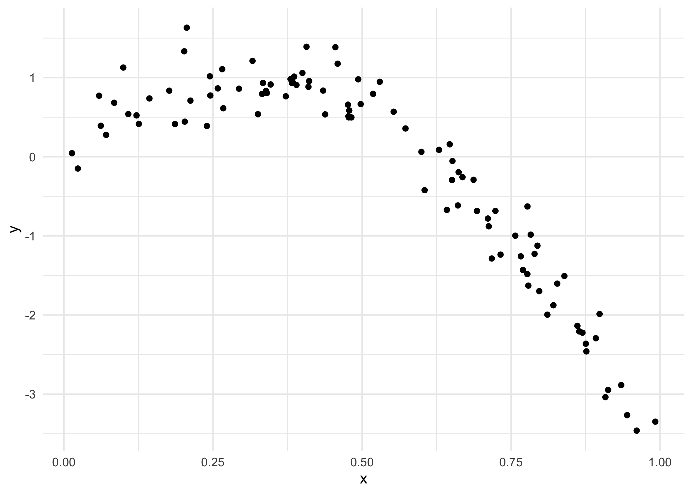
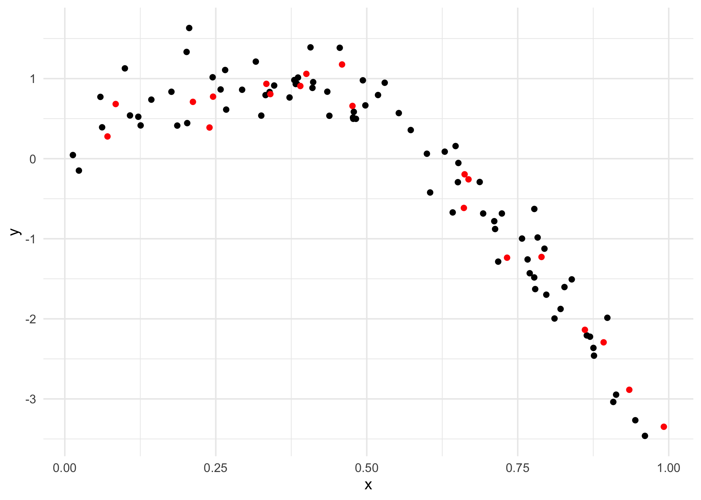
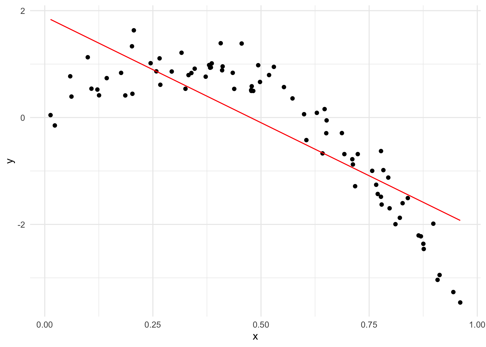
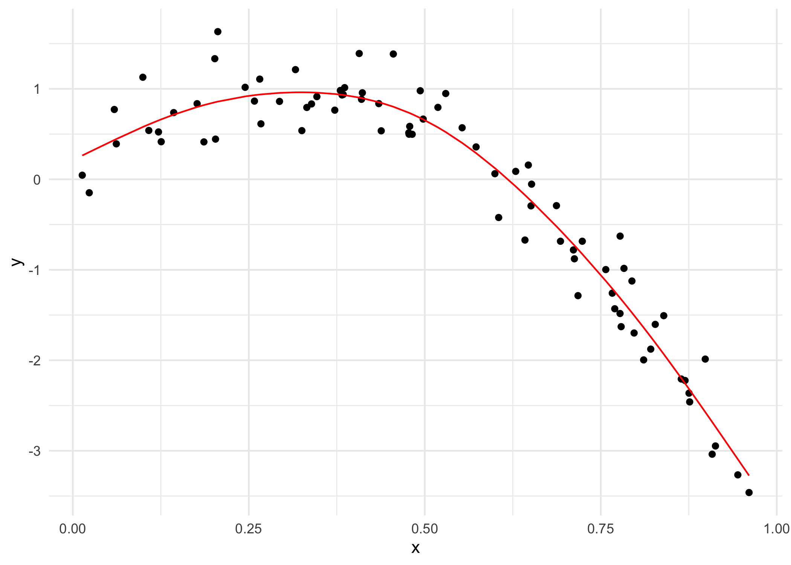
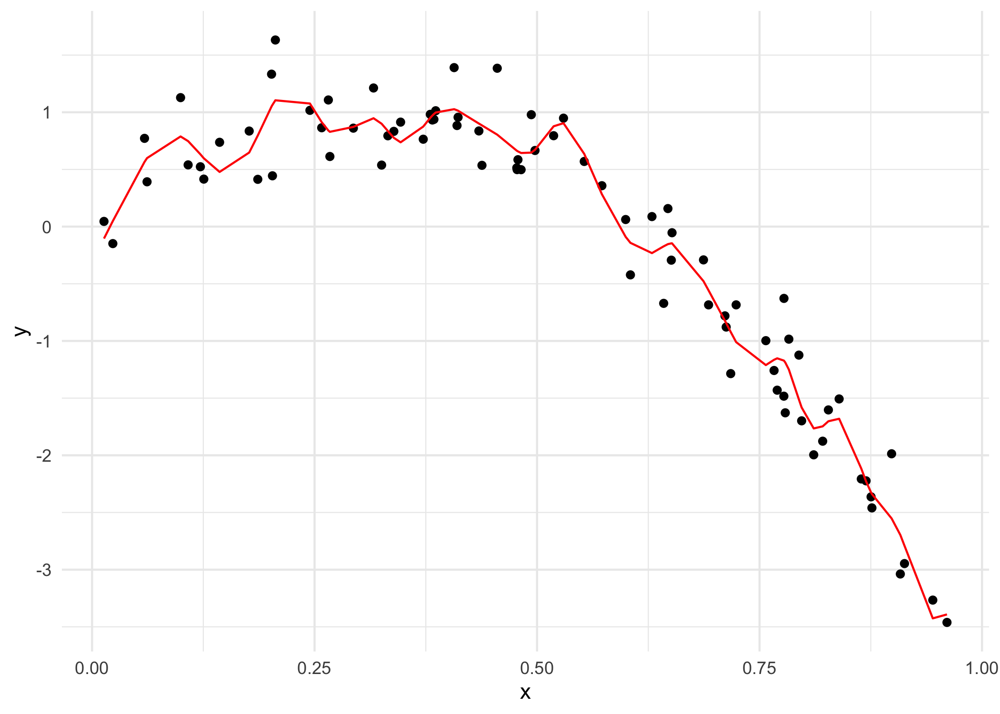
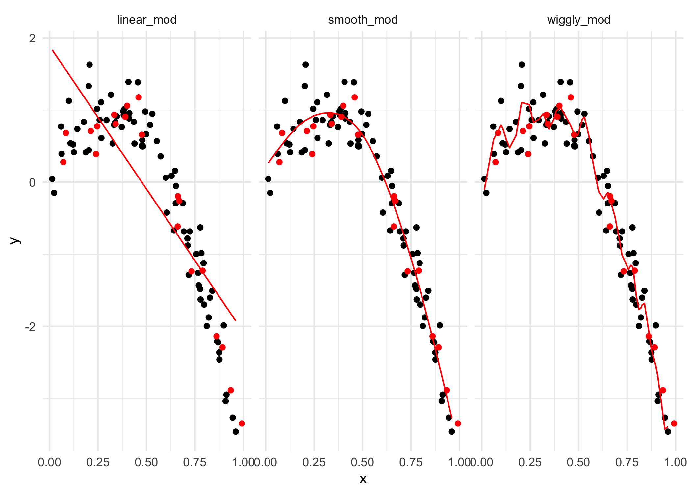

cross_validation
================
Tianshu Liu
2022-11-15

``` r
set.seed(1)
```

# CV by hand

``` r
# generate data
nonlin_df = 
  tibble(
    id = 1:100,
    x = runif(100, 0, 1),
    y = 1 - 10 * (x - .3) ^ 2 + rnorm(100, 0, .3)
  )

nonlin_df %>% 
  ggplot(aes(x = x, y = y)) + 
  geom_point()
```



``` r
# split data
train_df = sample_n(nonlin_df, 80)
train_df
```

    ## # A tibble: 80 × 3
    ##       id      x       y
    ##    <int>  <dbl>   <dbl>
    ##  1    73 0.347   0.914 
    ##  2    27 0.0134  0.0456
    ##  3    41 0.821  -1.88  
    ##  4    15 0.770  -1.43  
    ##  5    57 0.316   1.21  
    ##  6    38 0.108   0.540 
    ##  7    62 0.294   0.861 
    ##  8     6 0.898  -1.99  
    ##  9     4 0.908  -3.04  
    ## 10    35 0.827  -1.60  
    ## # … with 70 more rows

``` r
test_df = anti_join(nonlin_df, train_df, by = "id")
test_df
```

    ## # A tibble: 20 × 3
    ##       id      x      y
    ##    <int>  <dbl>  <dbl>
    ##  1     8 0.661  -0.615
    ##  2    18 0.992  -3.35 
    ##  3    21 0.935  -2.89 
    ##  4    22 0.212   0.710
    ##  5    30 0.340   0.807
    ##  6    36 0.668  -0.258
    ##  7    46 0.789  -1.23 
    ##  8    49 0.732  -1.24 
    ##  9    52 0.861  -2.14 
    ## 10    55 0.0707  0.278
    ## 11    59 0.662  -0.195
    ## 12    63 0.459   1.18 
    ## 13    69 0.0842  0.683
    ## 14    74 0.334   0.935
    ## 15    75 0.476   0.659
    ## 16    76 0.892  -2.29 
    ## 17    78 0.390   0.908
    ## 18    83 0.400   1.06 
    ## 19    89 0.245   0.775
    ## 20    91 0.240   0.389

``` r
train_df %>% 
  ggplot(aes(x = x, y = y)) + 
  geom_point() + 
  geom_point(data = test_df, color = "red")
```



``` r
linear_mod = lm(y ~ x, data = train_df)
smooth_mod = mgcv::gam(y ~ s(x), data = train_df)
wiggly_mod = mgcv::gam(y ~ s(x, k = 30), sp = 10e-6, data = train_df)
```

``` r
train_df %>% 
  add_predictions(linear_mod) %>% 
  ggplot(aes(x = x, y = y)) + 
  geom_point() + 
  geom_line(aes(y = pred), color = "red")
```



``` r
train_df %>% 
  add_predictions(smooth_mod) %>% 
  ggplot(aes(x = x, y = y)) + 
  geom_point() + 
  geom_line(aes(y = pred), color = "red")
```



``` r
train_df %>% 
  add_predictions(wiggly_mod) %>% 
  ggplot(aes(x = x, y = y)) + 
  geom_point() + 
  geom_line(aes(y = pred), color = "red")
```



``` r
train_df %>% 
  gather_predictions(linear_mod, smooth_mod, wiggly_mod) %>% 
  mutate(model = fct_inorder(model)) %>% 
  ggplot(aes(x = x, y = y)) + 
  geom_point() + 
  geom_line(aes(y = pred), color = "red") + 
  facet_wrap(~model)
```



Make predictions and compare RMSEs

``` r
# make predictions
test_df %>% add_predictions(linear_mod)
```

    ## # A tibble: 20 × 4
    ##       id      x      y     pred
    ##    <int>  <dbl>  <dbl>    <dbl>
    ##  1     8 0.661  -0.615 -0.735  
    ##  2    18 0.992  -3.35  -2.05   
    ##  3    21 0.935  -2.89  -1.82   
    ##  4    22 0.212   0.710  1.05   
    ##  5    30 0.340   0.807  0.537  
    ##  6    36 0.668  -0.258 -0.766  
    ##  7    46 0.789  -1.23  -1.25   
    ##  8    49 0.732  -1.24  -1.02   
    ##  9    52 0.861  -2.14  -1.53   
    ## 10    55 0.0707  0.278  1.61   
    ## 11    59 0.662  -0.195 -0.740  
    ## 12    63 0.459   1.18   0.0659 
    ## 13    69 0.0842  0.683  1.55   
    ## 14    74 0.334   0.935  0.563  
    ## 15    75 0.476   0.659 -0.00274
    ## 16    76 0.892  -2.29  -1.65   
    ## 17    78 0.390   0.908  0.340  
    ## 18    83 0.400   1.06   0.300  
    ## 19    89 0.245   0.775  0.914  
    ## 20    91 0.240   0.389  0.937

``` r
# calculate and compare RMSE (lower is better)
rmse(linear_mod, test_df)
```

    ## [1] 0.7052956

``` r
rmse(smooth_mod, test_df)
```

    ## [1] 0.2221774

``` r
rmse(wiggly_mod, test_df)
```

    ## [1] 0.289051

# Iterate

``` r
cv_df = 
  crossv_mc(nonlin_df, 100)

# quick view of train[1]
cv_df %>% 
  pull(train) %>% 
  .[[1]] %>% as.tibble()
```

    ## # A tibble: 79 × 3
    ##       id      x       y
    ##    <int>  <dbl>   <dbl>
    ##  1     1 0.266   1.11  
    ##  2     2 0.372   0.764 
    ##  3     3 0.573   0.358 
    ##  4     4 0.908  -3.04  
    ##  5     6 0.898  -1.99  
    ##  6     7 0.945  -3.27  
    ##  7     8 0.661  -0.615 
    ##  8     9 0.629   0.0878
    ##  9    10 0.0618  0.392 
    ## 10    11 0.206   1.63  
    ## # … with 69 more rows

``` r
cv_df = 
  cv_df %>% 
  mutate(
    train = map(train, as.tibble),
    test = map(test, as.tibble)
  ) %>% 
  mutate(
    linear_fits = map(.x = train, ~lm(y ~ x, data = .x)) 
  )
  
cv_df
```

    ## # A tibble: 100 × 4
    ##    train             test              .id   linear_fits
    ##    <list>            <list>            <chr> <list>     
    ##  1 <tibble [79 × 3]> <tibble [21 × 3]> 001   <lm>       
    ##  2 <tibble [79 × 3]> <tibble [21 × 3]> 002   <lm>       
    ##  3 <tibble [79 × 3]> <tibble [21 × 3]> 003   <lm>       
    ##  4 <tibble [79 × 3]> <tibble [21 × 3]> 004   <lm>       
    ##  5 <tibble [79 × 3]> <tibble [21 × 3]> 005   <lm>       
    ##  6 <tibble [79 × 3]> <tibble [21 × 3]> 006   <lm>       
    ##  7 <tibble [79 × 3]> <tibble [21 × 3]> 007   <lm>       
    ##  8 <tibble [79 × 3]> <tibble [21 × 3]> 008   <lm>       
    ##  9 <tibble [79 × 3]> <tibble [21 × 3]> 009   <lm>       
    ## 10 <tibble [79 × 3]> <tibble [21 × 3]> 010   <lm>       
    ## # … with 90 more rows
